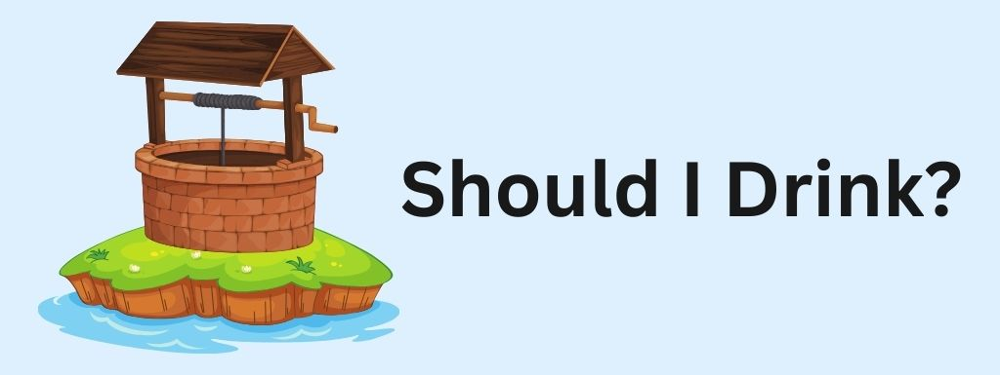

# Should I drink?


## A user friendly web app that provides up-to-date water quality statistics for your local area
[Web App URL](http://http://13.211.188.171/)

Christchurch’s drinking water is one of the best water supplies in the world. It is drawn from aquifers deep underground. It is regularly tested and maintained in line with the Drinking Water Standards for New Zealand. However, not everyone has access to a Council managed supply. Communities in rural areas may their own water supply. In the rural areas of Canterbury, agriculture is more prominent, [cow urine](https://www.phcc.org.nz/briefing/nitrate-contamination-drinking-water-and-adverse-birth-outcomes-emerging-evidence) and synthetic nitrogen fertilizer are used predominantly by the dairy industry and are leading sources of nitrate contamination. Private sources of water like domestic self-supplies are not subject to any monitoring, [which creates a risk to public health](https://environment.govt.nz/assets/publications/Freshwater/risks-associated-with-nitrates-in-drinking-water.pdf). \
\
“Should I Drink?” is a web app designed to bridge this gap in monitoring your water quality in the Canterbury Region. Users can input their location through a search bar to receive daily data on the five nearest wells. The data is pubically avaiable and is sourced from Evniornment Canterbury. The data used in our web app is updated regularly. 

The data is compared against accepted drinking water standards. The app visualizes these comparisons, highlighting any deviations from safe levels from various biological contaminants like E. coli and chemical contaminants such as nitrates. This empowers Canterbury residents with crucial information about their water quality, helping them make informed decisions to protect their health.

### How to use the web app

## INSERT IMAGES HERE ON HOW SOMEONE WOULD USE THE WEBSITE

### Installation instructions

#### Prerequisites
The following bullet points outline the software that should be already installed before trying to replicate our project:
- AWS CLI and SAM installed <- Required for EC2 instances (Does not depend on anything)
- Terraform installed <- Required for implementation of HDG-Controller (Depends on AWS-CLI and SAM)
- Docker installed <- Required for on configuration of tasks (does not depend on anything)
- Ansible installed <- required for configuration of various roles (does no depend on anything)

    
#### Setup Environment
- An AWS RDS (or equaivanent database infrastructure, using PostgreSQL)
- Setup .env file with DB_USER, DB_PASSWORD, DB_HOST, DB_PORT, DB_NAME fields 
- Edit the fields of the main.tf and variables.tf such that it has your own credentials

# Starting the automation process
Under the root directory of the git repository make sure a folder called "logs" exists.

under the build\aws-terraform\HDG-Controller, run the create_instance.sh by using the following
```sh
bash create_instance.sh
```

Database definitions can be reviewed [here](./docs/SHD_Data_Dictionary.pdf)

### Challenges, limitations and future improvements


## Challenges
- One of the challenges with this project was getting the scripts to work within a docker container ... 
- Getting terraform to work with remote-executor
- Creating log friendly json output using python
- Working with git branch conflicts
## Future improvements
- Having machine learning models
- Data redundancy
- More platform independance
